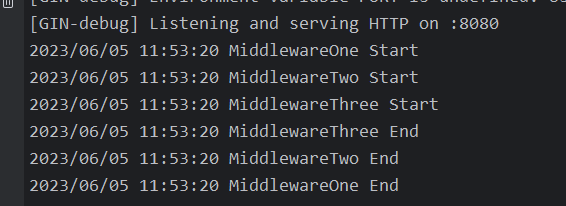

# Go - Gin 中间件

## 中间件的常用写法-闭包

```go
func authMiddleware(doCheck bool) gin.HandlerFunc{
    //连接数据库
    //或准备工作
    return func(c *gin.Context){
        //是否登录判断
        //if是登录用户
        //c.Next()
        //else
        //c.Abort()
    }
}
```

## 中间件执行顺序

中间件的执行顺序是按照添加顺序来的，这也是为什么通常被称为中间件链的原因

```go
func MiddlewareOne() func(c *gin.Context) {
    return func(c *gin.Context) {
        log.Println("MiddlewareOne Start")
        c.Next()
        log.Println("MiddlewareOne End")
    }
}

func MiddlewareTwo() func(c *gin.Context) {
    return func(c *gin.Context) {
        log.Println("MiddlewareTwo Start")
        c.Next()
        log.Println("MiddlewareTwo End")
    }
}
func MiddlewareThree() func(c *gin.Context) {
    return func(c *gin.Context) {
        log.Println("MiddlewareThree Start")
        c.Next()
        log.Println("MiddlewareThree End")
    }
}
```

```go
r.Use(MiddlewareOne())
    r.Use(MiddlewareTwo())
    r.Use(MiddlewareThree())

    r.GET("/hello", func(c *gin.Context) {
        c.String(200, "go")
    })
```



## 中间件通信

```go
func m1(c *gin.Context){
    fmt.Println("m1 in ...")

    start := time.Now()
    c.Next()
    cost:=time.Since(start)
    fmt.Printf("cost:%v\n",cost)
    fmt.Println("m1 out...")
}

func m2(c *gin.Context){
    fmt.Println("m2 in...")
    //中间件存值
    c.Set("name","carfield")
    fmt.Println("m2 out...")
    //其他中间件取值
    // c.Get
    // c.MustGet
}
```

## 自定义日志格式

```go
package filters

import (
    "fmt"

    "github.com/gin-gonic/gin"
)

func LogFilter() gin.HandlerFunc {
    return gin.LoggerWithFormatter(func(param gin.LogFormatterParams) string {
        // 你的自定义格式
        return fmt.Sprintf("%s\t|\t%s|\t%s|\t%s|\t%s|\t%d|\t%s|\t%s|\t%s \n",
            //客户端IP
            param.ClientIP,
            //时间格式
            param.TimeStamp.Format("2006-01-02 15:04:05"),
            //http请求方式 get post等
            param.Method,
            //客户端请求的路径
            param.Path,
            //http请求协议版本
            param.Request.Proto,
            //http请求状态码
            param.StatusCode,
            //耗时
            param.Latency,
            //http请求代理头
            param.Request.UserAgent(),
            //处理请求错误时设置错误消息
            param.ErrorMessage,
        )
    })
}
```

```go
package main

import (
    "fmt"
    "io"
    "log"
    "net/http"
    "os"
    "matuto.cc/go-gin-study/filters"
    "github.com/gin-gonic/gin"
)

func main() {
    // 创建一个不包含中间件的路由器
    r := gin.New()

    // 禁用控制台颜色
    gin.DisableConsoleColor()
    //创建日志文件
    f, _ := os.Create("gin.log")
    gin.DefaultWriter = io.MultiWriter(f)
    // 如果需要将日志同时写入文件和控制台，请使用以下代码
    // gin.DefaultWriter = io.MultiWriter(f, os.Stdout)
    // 全局中间件
    //使用Logger中间件
    r.Use(filters.LogFilter())
    //使用Recovery中间件
    r.Use(gin.Recovery())

    r.GET("/ping", func(c *gin.Conte
xt) {
        c.String(200, "pong")
    })
    r.run()
}
```

## 使用BasicAuth()中间件进行验证

```go
var secrets = gin.H{
    "zhangsan": gin.H{"account": "zhangsan", "email": "zhangsan@qq.com"},
    "lisi":     gin.H{"account": "lisi", "email": "lisi@qq.com"},
    "wangwu":   gin.H{"account": "wangwu", "email": "wangwu@qq.com"},
}


authorized := r.Group("/admin", gin.BasicAuth(gin.Accounts{
        "zhangsan": "123456",
        "lisi":     "123456",
        "wangwu":   "123456",
    }))
    authorized.GET("/secrets", func(c *gin.Context) {
        user := c.MustGet(gin.AuthUserKey).(string)

        if secret, ok := secrets[user]; ok {
            c.JSON(http.StatusOK, gin.H{
                "user":   user,
                "secret": secret,
            })
        } else {
            c.JSON(200, gin.H{
                "user":   user,
                "secret": "No Secret",
            })
        }
    })
```

页面访问 http://ip:port/admin/secrets

## 中间件中使用Goroutines

在中间件或处理程序中启动新的Goroutines时，你不应该使用其中的原始上下文，你必须使用只读副本（`c.Copy()`）

```go
r.GET("/long_async", func(c *gin.Context) {
        // 创建要在goroutine中 使用的副本
        cCp := c.Copy()
        go func() {
            time.Sleep(5 * time.Second)
            // 这里使用创建的副本
            log.Println("Done! in path " + cCp.Request.URL.Path)
        }()
    })
    r.GET("/long_sync", func(c *gin.Context) {
        // simulate a long task with time.Sleep(). 5 seconds
        time.Sleep(5 * time.Second)

        // 这里没有使用goroutine，所以不用使用副本
        log.Println("Done! in path " + c.Request.URL.Path)
    })
```
